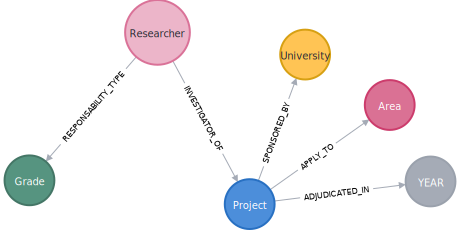
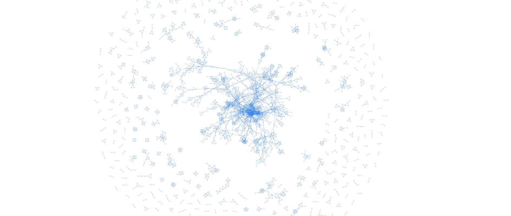

# Grafo FONDECYT

Disponible en Railway.app: https://grafo-fondecyt-production.up.railway.app/

## *Home*

*Knowledge graph* construido a partir de un *data set* de proyectos Fondecyt. El esquema corresponde a:

Para disminuir la carga de esta página de la aplicación, se aplican filtros obligatorios por universidad y año al *knowledge graph*. Los filtros se encuentran disponibles bajo la visualización del grafo.

En la parte inferior se podrán ver distintas estadísticas respecto a la universidad seleccionada.

## Página 2

Red de co-ocurrencias de investigadores de proyectos Fondecyt. Se forma un *edge* entre dos investigadores si han trabajado en el mismo proyecto. Mientras más colaboraciones entre los mismos dos investigadores, mayor es el grosor de la arista. A mayor número de colaboraciones con distintos investigadores, el nodo (investigador) es de mayor tamaño.

