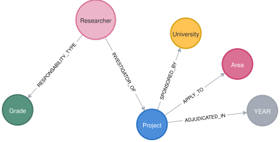

# Grafo FONDECYT: Análisis Exploratorio e Interactividad

[](https://grafo-fondecyt-production.up.railway.app/)
[](https://www.python.org/downloads/)
[](https://dash.plotly.com/)

Este proyecto es una plataforma de **Análisis Exploratorio de Grafos (EGA)** y **Data Storytelling** diseñada para visualizar y comprender el ecosistema de investigación financiado por el fondo FONDECYT en Chile (periodo 2012-2019). A través de una interfaz interactiva construida con **Plotly Dash**, la aplicación permite descubrir patrones de colaboración, hegemonía institucional y trayectorias académicas.



## 🚀 Pilares del Proyecto

### 1. Análisis Exploratorio de Grafos (EGA)
El núcleo del proyecto utiliza **NetworkX** y **Dashvis** para modelar y visualizar grafos complejos:
- **Knowledge Graph:** Una red multidimensional que conecta investigadores, proyectos, universidades y áreas de estudio. Permite entender el contexto completo de una adjudicación.
- **Red de Co-ocurrencias:** Análisis de la colaboración científica donde los nodos (investigadores) crecen según su grado de conectividad y las aristas según la frecuencia de trabajo conjunto.

### 2. Data Storytelling
Más que una simple visualización, la plataforma guía al usuario a través de narrativas de datos:
- **Hegemonía Institucional:** Exploración visual de la concentración del financiamiento en el sistema universitario chileno.
- **Evolución Temática:** Uso de *bump charts* y análisis temporales para observar el ascenso y caída de distintas áreas del conocimiento.
- **Calidad y Desempeño:** Distribución de calificaciones y métricas de éxito por área y año.

### 3. Interactividad Avanzada
Gracias a la integración con **Plotly Dash**, la exploración es dinámica y bidireccional:
- **Filtros en Tiempo Real:** Segmentación por universidad, año y área de estudio con actualización instantánea de grafos y métricas.
- **Exploración Visual:** Grafos navegables con zoom, selección de nodos y *tooltips* informativos.
- **Sincronización:** Gráficos estadísticos (treemaps, donas, histogramas) que reaccionan a la navegación del grafo.

---

## 📂 Estructura de la Aplicación

La plataforma se organiza en cuatro ejes principales:

1.  **Grafo de Conocimiento (Home):** Visualización global de la red FONDECYT con filtros obligatorios por institución para garantizar rendimiento y claridad.
2.  **Red de Colaboración:** Análisis profundo de la red de co-autores y colaboradores, permitiendo identificar clústeres de investigación y líderes de red.
3.  **Tendencias del Sistema:** Un espacio dedicado al storytelling donde se analiza si el financiamiento se ha democratizado y cómo han mutado las prioridades científicas.
4.  **Trayectorias e Investigadores:** Análisis de movilidad académica, evolución de postdoctorados y colaboración interdisciplinaria.

---

## 🛠️ Stack Tecnológico

-   **Frontend & Dashboard:** [Dash](https://dash.plotly.com/), Dash Bootstrap Components.
-   **Visualización de Redes:** [Dashvis](https://github.com/Orion89/dashvis), [Pyvis](https://pyvis.readthedocs.io/).
-   **Procesamiento de Datos:** [Pandas](https://pandas.pydata.org/), NumPy.
-   **Análisis de Grafos:** [NetworkX](https://networkx.org/).
-   **Gráficos Estadísticos:** [Plotly Express/Graph Objects](https://plotly.com/python/).

---

## 🔧 Instalación Local

1. **Clonar el repositorio:**
   ```bash
   git clone https://github.com/Orion89/grafo-fondecyt.git
   cd grafo-fondecyt
   ```

2. **Instalar dependencias:**
   ```bash
   pip install -r requirements.txt
   ```

3. **Ejecutar la aplicación:**
   ```bash
   python app.py
   ```
   La aplicación estará disponible en `http://localhost:8050`.

---

> **Nota:** Este es un proyecto académico desarrollado por [Leonardo Molina V.](https://www.linkedin.com/in/leonardo-molina-v-68a601183/) para la exploración visual de datos científicos.
